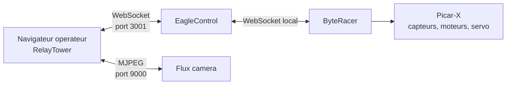

# ByteRacer

ByteRacer est un projet de robot Picar-X pilotable depuis une interface web, avec controle a la manette, telemetrie temps reel, flux camera, sons, TTS, gestion reseau et commandes GPT.

## Composants du systeme

Le depot s'appuie sur trois briques principales:

- `byteracer/`: service Python qui pilote le robot, gere les capteurs, la camera, le TTS, les sons, l'audio et l'IA.
- `eaglecontrol/`: serveur WebSocket Bun/Hono qui route les messages entre le robot et les clients.
- `relaytower/`: interface web Next.js pour piloter le robot, visualiser son etat et modifier sa configuration.

## Documentation

- Architecture globale: `docs/ARCHITECTURE.md`
- Communications entre modules et protocole: `docs/MODULE_COMMUNICATIONS.md`
- Installation et demarrage: `docs/INSTALLATION.md`

## Vue rapide de l'architecture



## Ports utilises

- `http://<host>:3000`: interface `RelayTower`
- `ws://<host>:3001/ws`: bus temps reel `EagleControl`
- `http://<host>:3001/stats`: etat des connexions WebSocket
- `http://<host>:9000/mjpg`: flux camera MJPEG

## Fonctionnalites principales

- pilotage temps reel via manette;
- telemetrie capteurs et etats d'urgence;
- camera avec surveillance du gel et redemarrage;
- TTS et effets sonores embarques;
- commandes systeme depuis l'interface;
- scan et configuration reseau Wi-Fi / point d'acces;
- streaming audio entrant et sortant;
- integration GPT avec statut temps reel;
- diffusion des logs jusqu'a l'interface.

## Structure du depot

```text
.
├── byteracer/      # Service Python et integrations materielles
├── eaglecontrol/   # Serveur WebSocket Bun/Hono
├── relaytower/     # Interface web Next.js
├── docs/           # Documentation technique et installation
├── prompt.md       # Synthese projet / notes fonctionnelles
└── startup.sh      # Script de boot et de demarrage production
```

## Demarrage rapide

### Mode production sur le robot

```bash
cd /home/pi/ByteRacer
bash startup.sh
```

### Mode manuel

Dans trois terminaux distincts:

```bash
# terminal 1
cd eaglecontrol
bun run start

# terminal 2
cd relaytower
bun run start

# terminal 3
cd byteracer
sudo python3 main.py
```

Le detail complet des prerequis, de l'installation et des commandes de verification est documente dans `docs/INSTALLATION.md`.

## Notes importantes

- `startup.sh` est pense pour une machine cible de type appliance et peut remettre le depot a l'etat de la branche distante si l'auto-update est active.
- La configuration persistante du robot est stockee dans `byteracer/config/settings.json`.
- Le flux camera ne passe pas par le WebSocket: il est servi separement en MJPEG.

## Pour aller plus loin

- `docs/ARCHITECTURE.md` pour la decomposition des services et le cycle de vie.
- `docs/MODULE_COMMUNICATIONS.md` pour les callbacks internes, les evenements WebSocket et les cadences de mise a jour.
- `docs/INSTALLATION.md` pour l'installation Raspberry Pi, le mode manuel et le depannage.