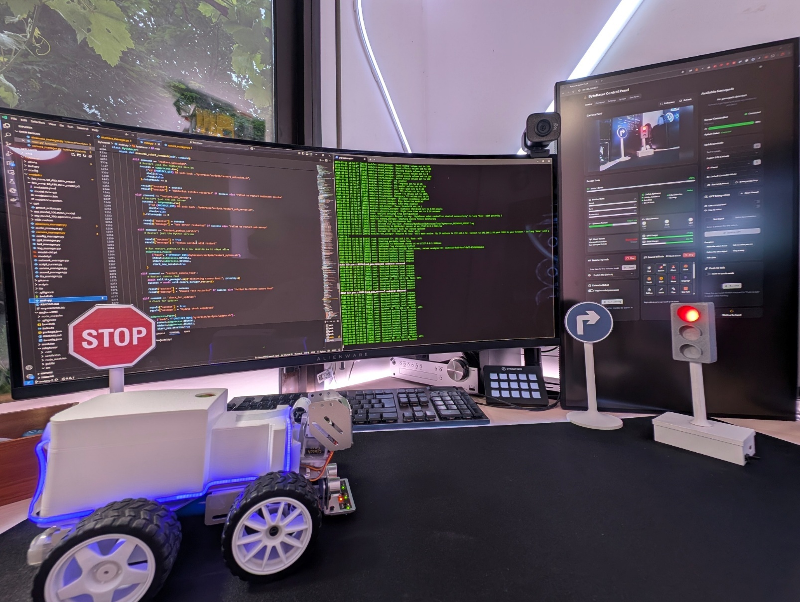
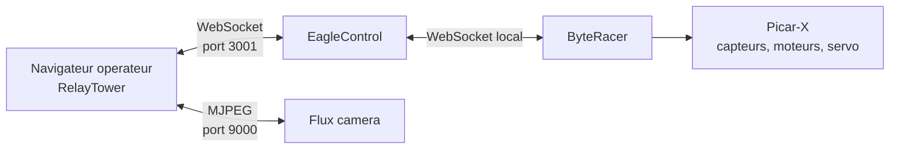
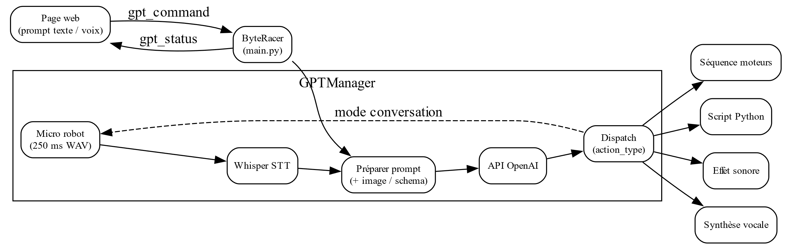
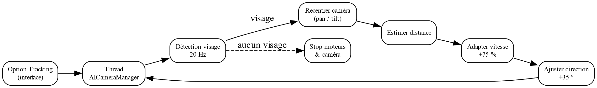
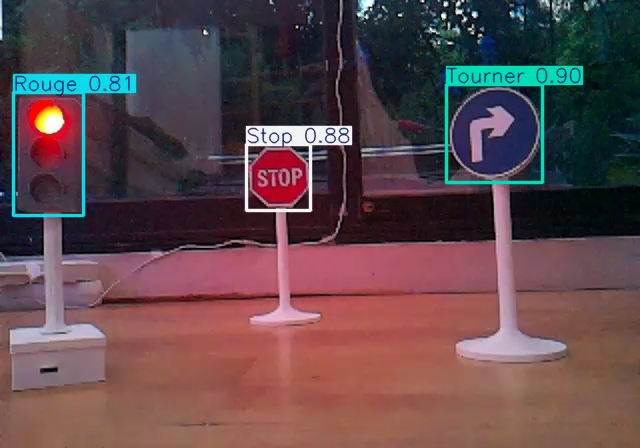

# ByteRacer

ByteRacer est un projet de robot Picar-X pilotable depuis une interface web, avec controle a la manette, telemetrie temps reel, flux camera, sons, TTS, gestion reseau, streaming audio, integration ChatGPT et modes autonomes bases sur la vision.



## Composants du systeme

Le depot s'appuie sur trois briques principales:

- `byteracer/`: service Python qui pilote le robot, gere les capteurs, la camera, le TTS, les sons, l'audio et l'IA.
- `eaglecontrol/`: serveur WebSocket Bun/Hono qui route les messages entre le robot et les clients.
- `relaytower/`: interface web Next.js pour piloter le robot, visualiser son etat et modifier sa configuration.

## Documentation

- [Vue d'ensemble de la documentation](docs/README.md)
- [Architecture globale](docs/ARCHITECTURE.md)
- [Communications entre modules et protocole](docs/MODULE_COMMUNICATIONS.md)
- [Installation Raspberry Pi et mise en service](docs/INSTALLATION.md)
- [Orchestrateur principal `ByteRacer`](docs/MAIN_ORCHESTRATOR.md)
- [Web app `RelayTower`](docs/WEB_APP.md)
- [Integration IA, ChatGPT et conduite autonome](docs/AI_INTEGRATION.md)
- [Index des modules Python](docs/PYTHON_MODULES/README.md)

## Vue rapide de l'architecture



## Diagrammes clefs






Autres extraits utiles:

- [Flux de pilotage manuel](docs/media/synoptic/control-flow.png)
- [Flux audio bidirectionnel](docs/media/synoptic/audio-flow.png)
- [Schema de cablage ESP32](docs/media/synoptic/esp32-wiring.png)
- [Courbes d'entrainement YOLO](docs/media/synoptic/yolo-training-metrics.png)

## Ports utilises

- `http://<host>:3000`: interface `RelayTower`
- `ws://<host>:3001/ws`: bus temps reel `EagleControl`
- `http://<host>:3001/stats`: etat des connexions WebSocket
- `http://<host>:9000/mjpg`: flux camera MJPEG

## Fonctionnalites principales

- pilotage temps reel via manette et interface web;
- telemetrie capteurs, batterie et etats d'urgence;
- camera avec surveillance du gel et redemarrage;
- TTS et effets sonores embarques;
- commandes systeme depuis l'interface;
- scan et configuration reseau Wi-Fi / point d'acces;
- streaming audio entrant et sortant;
- integration GPT avec statut temps reel et scripts Python controles;
- suivi de visage, reconnaissance de feux/panneaux et conduite autonome.

## Structure du depot

```text
.
├── byteracer/      # Service Python et integrations materielles
├── eaglecontrol/   # Serveur WebSocket Bun/Hono
├── relaytower/     # Interface web Next.js
├── docs/           # Documentation technique, architecture et medias
├── prompt.md       # Synthese projet / notes fonctionnelles
└── startup.sh      # Script de boot et de demarrage production
```

## Demarrage rapide

### Mode production sur le robot

```bash
cd /home/pi/ByteRacer
bash startup.sh
```

### Diagnostic rapide

```bash
cd /home/pi/ByteRacer
bash byteracer/scripts/doctor.sh
```

Ce rapport affiche les services `systemd` ou `screen`, les ports ouverts, l'etat reseau, le commit courant et les derniers logs utiles.

### Installation appliance recommandee

Sur un Raspberry Pi propre, le script de bootstrap installe les dependances, recupere uniquement l'applicatif via sparse checkout, build l'interface statique, installe les services `systemd`, installe AccessPopup et applique des reglages qui reduisent les ecritures sur la carte SD:

```bash
curl -fsSL https://raw.githubusercontent.com/nayzflux/byteracer/working-2/byteracer/scripts/bootstrap_raspberry_pi.sh -o bootstrap_raspberry_pi.sh
bash bootstrap_raspberry_pi.sh
sudo reboot
```

Apres redemarrage:

```bash
sudo systemctl start byteracer-stack.target
bash /home/pi/ByteRacer/byteracer/scripts/doctor.sh
```

### Mode manuel

Dans trois terminaux distincts:

```bash
# terminal 1
cd eaglecontrol
bun run start

# terminal 2
cd relaytower
bun run start

# terminal 3
cd byteracer
sudo python3 main.py
```

Le detail complet des prerequis, de l'installation, des calibrations Picar-X et des commandes de verification est documente dans [docs/INSTALLATION.md](docs/INSTALLATION.md).

## Presentation et medias

Cette refonte de documentation reprend les informations de la presentation TIPE et du synoptique du projet:

- [Presentation PDF](Présentation%20TIPE%20FINAL.pdf)
- [Presentation PowerPoint](Présentation%20TIPE%20FINAL.pptx)
- [Synoptique PDF](Synoptique%20TIPE%202025%20Final%20V3.pdf)
- [Synoptique source DOCX](Synoptique%20TIPE%202025%20v2%20%281%29%20%281%29.docx)

### Apercus




### Demos video

- [Pilotage a distance](docs/media/presentation/remote-control-demo.mp4)
- [Interaction ChatGPT / interface](docs/media/presentation/gpt-integration-demo.mp4)
- [Suivi de visage](docs/media/presentation/face-tracking-demo.mp4)
- [Conduite autonome](docs/media/presentation/autonomous-driving-demo.mp4)

## Notes importantes

- `startup.sh` est pense pour une machine cible de type appliance et peut remettre le depot a l'etat de la branche distante si l'auto-update est active.
- La configuration persistante du robot est stockee dans `byteracer/config/settings.json`.
- Le flux camera ne passe pas par le WebSocket: il est servi separement en MJPEG.
- Le script `byteracer/install.sh` ne couvre qu'une partie de la pile materielle; la sequence complete est detaillee dans la documentation d'installation.

## Pour aller plus loin

- [Architecture](docs/ARCHITECTURE.md) pour la decomposition des services et le cycle de vie.
- [Communications](docs/MODULE_COMMUNICATIONS.md) pour les callbacks internes, les evenements WebSocket et les cadences de mise a jour.
- [Orchestrateur principal](docs/MAIN_ORCHESTRATOR.md) pour le dispatch des commandes et le cycle de boot.
- [Web app](docs/WEB_APP.md) pour le detail de `RelayTower`.
- [AI integration](docs/AI_INTEGRATION.md) pour le pipeline GPT, la conversation vocale et l'autonomie.
- [Modules Python](docs/PYTHON_MODULES/README.md) pour un detail fichier par fichier.
