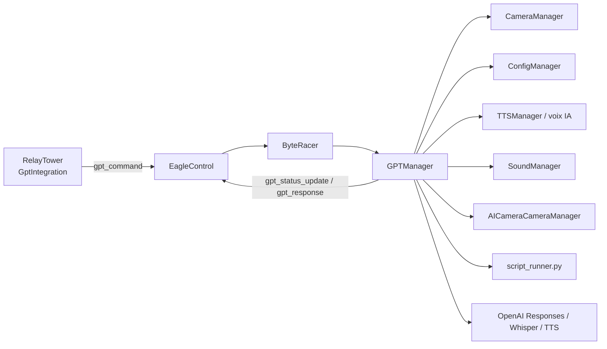
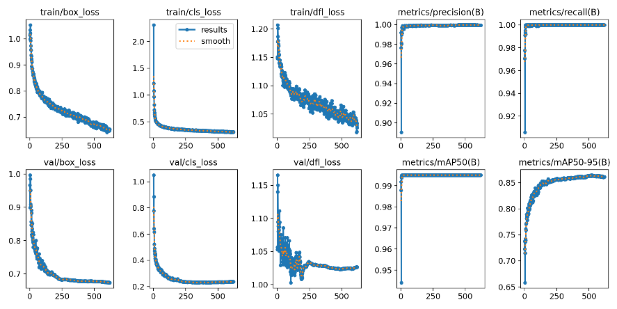
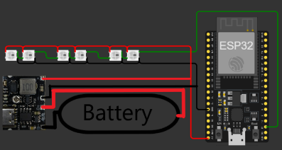

# Integration IA, ChatGPT Et Conduite Autonome

## Objectif

La couche IA de ByteRacer combine deux sous-systemes distincts mais relies:

- `GPTManager` pour l'interpretation des commandes naturelles, le dialogue, la generation d'actions et l'execution controlee;
- `AICameraCameraManager` pour la vision embarquee, le suivi de visage, la reconnaissance de panneaux/feux et la conduite autonome.

La presentation du projet montre clairement que l'IA n'est pas un bloc separe: elle est branchee au meme bus WebSocket, a la meme configuration persistante et aux memes primitives de mouvement que le controle manuel.

## Vue d'ensemble du pipeline IA

## 1. `GPTManager`: role et philosophie

`GPTManager` transforme une demande utilisateur en actions robotiques tout en gardant le controle local sur la securite et l'execution. Son role n'est pas seulement de generer du texte:

- il enrichit le prompt avec le contexte du robot;
- il peut capturer une image camera au moment de l'appel;
- il maintient un contexte de conversation entre requetes;
- il parse une reponse structuree, pas du texte libre seulement;
- il peut executer des fonctions predefinies, des sequences moteur ou un script Python isole;
- il renvoie des statuts progressifs pour que l'interface reste explicable.

## 2. Origine des commandes GPT

L'interface `GptIntegration.tsx` peut lancer une requete avec plusieurs options:

- prompt texte simple;
- capture camera jointe;
- reponse vocale IA;
- mode conversation;
- creation d'un nouveau thread de conversation.

Le front envoie ensuite `gpt_command` vers `ByteRacer`, qui passe le robot en `GPT_CONTROLLED` le temps du traitement.

## 3. Preparation du contexte avant appel OpenAI

Avant d'appeler l'API, `GPTManager` prepare un contexte riche:

- etat et capacites du Picar-X;
- schema des actions autorisees;
- informations capteurs;
- regles de securite et de bon usage des moteurs;
- outils logiques exposes a l'IA;
- eventuellement image camera encodee;
- contexte conversationnel precedent via `current_response_id`.

La cle API est lue depuis:

1. `OPENAI_API_KEY`;
2. `settings.api.openai_api_key`.

Le modele par defaut decrit dans le code est `gpt-4.1-2025-04-14` avec des usages complements pour:

- transcription voix: `whisper-1`;
- voix de synthese: `gpt-4o-mini-tts`.

## 4. Contrat de reponse IA

Le coeur de la robustesse vient du fait que `GPTManager` attend une structure contrainte. Les actions autorisees sont principalement:

- `none`;
- `predefined_function`;
- `motor_sequence`;
- `python_script`.

Chaque reponse peut contenir:

- un texte a afficher;
- un texte a prononcer;
- une action unique ou plusieurs actions sequencees;
- des metadonnees de statut retournees a l'interface.

Ce choix evite de laisser le modele "parler directement" au hardware sans mediation.

## 5. Actions predefinies

`execute_predefined_function()` couvre un large eventail de primitives:

- mouvement: avancer, reculer, tourner, stopper;
- camera: orienter pan/tilt;
- capteurs: lire la distance ou l'etat global;
- audio: parler, jouer un son, stopper un son;
- modes: face tracking, circuit mode, couleur, detection panneaux;
- reseau et systeme: scan Wi-Fi, mise a jour, reboot, shutdown;
- reglages: modifier des seuils et parametres AI;
- expressions corporelles: les animations de `preset_actions.py`.

L'approche est importante pour la maintenabilite: tant qu'une intention utilisateur peut etre exprimee via une fonction predefinie, il est preferable de ne pas passer par un script libre.

## 6. Scripts Python controles

Quand le modele renvoie `python_script`, l'execution passe par un environnement isole:

- le script est prepare avec un environnement limite;
- il recupere seulement des primitives choisies (`px`, `tts`, `sound`, `get_camera_image`, LED, etc.);
- l'execution peut etre annulee;
- les retours et erreurs sont reroutes vers le WebSocket.

Le module associe est documente dans [PYTHON_MODULES/SCRIPT_RUNNER.md](PYTHON_MODULES/SCRIPT_RUNNER.md).

L'objectif est double:

- garder une flexibilite experimentale pour des demos ou des comportements non pre-codes;
- proteger le reste du systeme contre des scripts trop ouverts.

## 7. Mode conversationnel

Le mode conversation active une boucle speciale:

1. le robot passe en ecoute locale;
2. le micro est lu cote robot;
3. la voix est transcrite;
4. le texte reconnu est renvoye via `speech_recognition`;
5. la reponse GPT est produite puis eventuellement vocalisee;
6. la conversation peut etre annulee ou resetee.

Deux points sont notables:

- le seuil `ai.speak_pause_threshold` controle le timing de coupure de parole;
- `current_response_id` est reutilise pour garder de la continuite entre tours de dialogue.

## 8. Retour utilisateur en temps reel

Pendant toute la duree du traitement, `GPTManager` emet des `gpt_status_update`:

- demarrage;
- ecoute en cours;
- transcription;
- appel modele;
- execution d'actions;
- erreur ou succes final.

Cette observabilite est importante parce que le temps de traitement peut varier selon:

- la presence d'un upload image;
- l'usage de Whisper;
- l'usage d'une synthese vocale IA;
- la complexite de l'action retournee.

## 9. Vision embarquee et autonomie: `AICameraCameraManager`

La deuxieme couche IA du projet est entierement locale. `AICameraCameraManager` ne depend pas de l'API OpenAI pour:

- suivre un visage;
- suivre une couleur;
- detecter des feux tricolores;
- detecter des panneaux stop et virage a droite;
- estimer la distance d'un objet detecte;
- conduire le robot selon des regles predefinies.

## 10. Face tracking

Le suivi de visage fonctionne comme une boucle de controle locale:

1. activation de la detection visage dans `CameraManager` / `Vilib`;
2. lancement d'un thread `_face_follow_loop()`;
3. lecture continue de la boite visage detectee;
4. calcul de la taille de cible et du decalage horizontal;
5. conversion en vitesse avant/arriere et correction de direction;
6. animation LED specifique pendant le mode tracking.

Les reglages les plus importants sont:

- `ai.target_face_area`;
- `ai.forward_factor`;
- `ai.face_tracking_max_speed`;
- `ai.speed_dead_zone`;
- `ai.turn_factor`.

L'effet cherche est visible dans la presentation: le robot garde un sujet cadre et adapte sa distance a la personne suivie.

## 11. Detection de panneaux et feux

La boucle YOLO est le coeur du mode autonome:

- chargement d'un modele NCNN local;
- lecture d'image depuis `CameraManager`;
- resize/crop vers l'entree modele;
- inference locale;
- reprojection des boites sur l'image d'origine;
- estimation de distance via un modele geometrique simple;
- tri des objets par priorite et distance;
- affichage des overlays sur `Vilib`.

Les classes prioritaires traitees explicitement sont:

- feu rouge / orange / vert;
- panneau stop;
- panneau de virage a droite.

## 12. Logique de conduite autonome

La conduite autonome n'est pas un comportement "boite noire". Elle repose sur des regles locales deterministes:

### Feux tricolores

- si le feu rouge ou orange est proche du seuil d'action, le robot s'arrete;
- il reste a l'arret jusqu'a voir un feu vert;
- un delai d'ignorance est applique ensuite pour eviter les retriggers immediats.

### Stop

- quand le panneau stop est suffisamment proche, le robot s'arrete;
- il attend `ai.stop_sign_wait_time`;
- il repart a la vitesse autonome;
- il ignore ensuite les stops pendant `ai.stop_sign_ignore_time`.

### Virage a droite

- quand un panneau de virage est detecte a la bonne distance, le robot prepare le turn;
- un delai `ai.wait_to_turn_time` peut etre applique;
- la boucle YOLO est suspendue pendant le virage;
- un clignotement LED de direction est lance;
- un virage a droite pre-calibre est execute pendant `ai.right_turn_time`.

## 13. Compensation moteur

Un detail important pour les demos reelles est la compensation de derive:

- `ai.motor_balance` permet d'ajuster la dissymetrie mecanique;
- `forward_with_balance()` applique cette correction pendant les modes autonomes;
- un mode de calibration moteur guide l'utilisateur pour tester le drift a basse vitesse.

Sans cette correction, les timings de conduite autonome deviennent vite peu fiables.

## 14. Parametres AI exposes dans `settings.json`

Les reglages importants exposes dans l'interface et relies a l'IA sont:

- `ai.speak_pause_threshold`
- `ai.distance_threshold_cm`
- `ai.turn_time`
- `ai.yolo_confidence`
- `ai.motor_balance`
- `ai.autonomous_speed`
- `ai.wait_to_turn_time`
- `ai.stop_sign_wait_time`
- `ai.stop_sign_ignore_time`
- `ai.traffic_light_ignore_time`
- `ai.target_face_area`
- `ai.forward_factor`
- `ai.face_tracking_max_speed`
- `ai.speed_dead_zone`
- `ai.turn_factor`

Ce point est important pour la refactorisation documentaire: une grande partie de l'IA est reglable sans changer le code.

## 15. Couplage entre GPT et vision locale

Les deux couches IA peuvent cooperer:

- GPT peut utiliser une image camera ponctuelle pour raisonner sur une scene;
- GPT peut demarrer ou stopper les modes de vision locale;
- GPT peut ajuster certains parametres AI;
- les actions GPT s'appuient sur les memes primitives de mouvement que la conduite autonome locale.

En revanche, la conduite autonome courante n'a pas besoin d'OpenAI pour prendre ses decisions reactives.

## 16. Garde-fous de securite

Les garde-fous se trouvent a plusieurs niveaux:

- schema de reponse contraint cote GPT;
- execution mediee par des fonctions predefinies ou par un runner isole;
- `SensorManager` garde le dernier mot en cas d'urgence;
- arret de certaines commandes manuelles pendant l'execution GPT;
- seuils de distance et de timing configurables pour l'autonomie.

## 17. Limites connues et pistes d'amelioration

- `GPTManager` reste un module tres gros: une decomposition par sous-domaines reduirait le cout de maintenance;
- la frontiere entre actions predefinies et scripts libres pourrait etre encore plus explicite;
- les actions YOLO sont aujourd'hui centrees sur quelques panneaux/feux prioritaires;
- une formalisation plus stricte des payloads `gpt_response` et `gpt_status_update` simplifierait le front.

## 18. Assets complementaires

## 19. Documents lies

- [MAIN_ORCHESTRATOR.md](MAIN_ORCHESTRATOR.md)
- [WEB_APP.md](WEB_APP.md)
- [PYTHON_MODULES/GPT_MANAGER.md](PYTHON_MODULES/GPT_MANAGER.md)
- [PYTHON_MODULES/AICAMERA_MANAGER.md](PYTHON_MODULES/AICAMERA_MANAGER.md)
- [PYTHON_MODULES/SCRIPT_RUNNER.md](PYTHON_MODULES/SCRIPT_RUNNER.md)
- [PYTHON_MODULES/PRESET_ACTIONS.md](PYTHON_MODULES/PRESET_ACTIONS.md)
