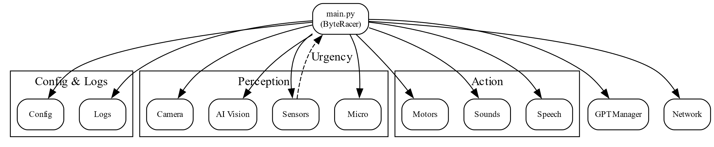
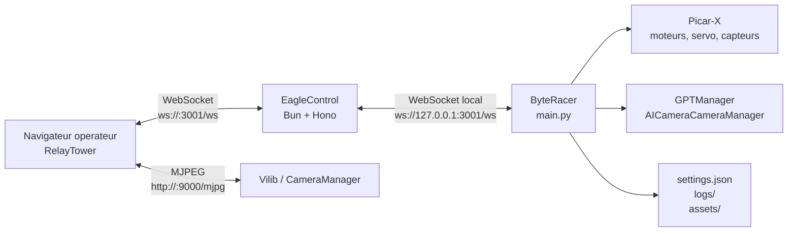
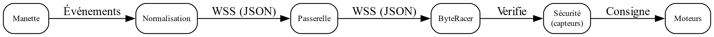
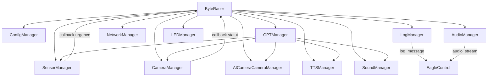
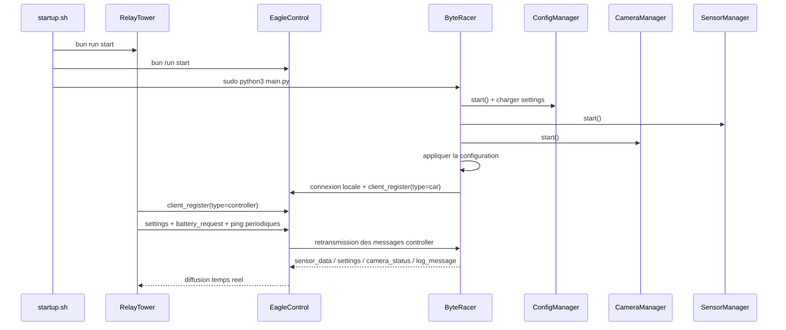

# Architecture Technique

## Objectif

ByteRacer est un systeme de teleoperation pour robot SunFounder Picar-X. Le depot rassemble trois briques executees sur le robot et exposees au navigateur de l'operateur:

- `byteracer/`: service Python qui pilote le robot et agrege les integrations materielles.
- `eaglecontrol/`: serveur WebSocket Bun/Hono qui route les messages en temps reel.
- `relaytower/`: interface web Next.js pour piloter, observer et configurer le robot.

## Vue d'ensemble

## Topologie d'execution

- Le Raspberry Pi heberge les trois services de production.
- `RelayTower` est servi en HTTP sur le port `3000`.
- `EagleControl` expose le endpoint WebSocket `ws://<host>:3001/ws` et le endpoint HTTP `http://<host>:3001/stats`.
- Le flux video MJPEG est expose par `Vilib` sur `http://<host>:9000/mjpg`.
- `ByteRacer` ne s'expose pas directement au reseau: il se connecte localement a `EagleControl` via `ws://127.0.0.1:3001/ws`.

## Repartition des responsabilites

### RelayTower

`RelayTower` est l'interface operateur. Ses responsabilites principales sont:

- etablir la connexion WebSocket vers `EagleControl`;
- lire l'etat de la manette via `GamepadProvider` et `GamepadInputHandler`;
- afficher la telemetrie, les logs, les statuts GPT, les reglages et le flux camera;
- convertir les actions UI en messages reseau (`robot_command`, `settings_update`, `gpt_command`, etc.).

Le point d'entree de la page est `relaytower/src/app/page.tsx`, qui enveloppe l'application avec `WebSocketProvider` et `GamepadProvider`.

### EagleControl

`EagleControl` joue le role de bus temps reel minimaliste:

- il classe les connexions en trois roles: `car`, `controller` et `viewer`;
- il route les evenements selon leur nature;
- il garde en memoire la liste des clients connectes;
- il repond localement a `ping`/`pong` et a `python_status_request`.

Il ne contient pas de logique de pilotage robot. La logique metier reste dans `ByteRacer`.

### ByteRacer

`ByteRacer` est l'orchestrateur applicatif et materiel. Sa classe principale, definie dans `byteracer/main.py`, instancie `Picarx` puis coordonne plusieurs managers specialises.

## Architecture interne de ByteRacer

### Managers et role fonctionnel

| Manager | Role principal | Dependances majeures |
| --- | --- | --- |
| `ConfigManager` | Charge, fusionne et sauvegarde `settings.json` | disque local |
| `SensorManager` | Surveille ultrasons, capteurs de ligne, batterie et etats d'urgence | `Picarx`, `LEDManager` |
| `CameraManager` | Lance la camera, surveille le gel du flux, redemarre si besoin | `Vilib`, `Picamera2` |
| `AICameraCameraManager` | Vision embarquee, tracking, mode circuit, calibration | `Picarx`, `SensorManager`, `CameraManager` |
| `TTSManager` | Synthese vocale asynchrone non bloquante | `pygame`, `pico2wave`, `sox`, `SoundManager` |
| `SoundManager` | Sons de conduite, alertes, sons customs et lecture audio entrante | `pygame`, `robot_hat.Music` |
| `AudioManager` | Capture micro locale et streaming audio vers le client | `PyAudio`, WebSocket |
| `GPTManager` | Interpretation des commandes naturelles, vision, conversation, TTS IA | OpenAI, camera, TTS, sons |
| `NetworkManager` | Wi-Fi, mode AP, scan de reseaux, IP courante | `nmcli`, `accesspopup` |
| `LogManager` | Logs fichiers, console et diffusion WebSocket | systeme de logging Python |
| `LEDManager` | Retour visuel local (clignotement, etat) | GPIO / configuration |

## Cycle de vie applicatif

### Demarrage effectif

Lors du lancement, `ByteRacer.start()`:

1. demarre `ConfigManager`, `TTSManager`, `SensorManager`, `CameraManager`, `LogManager` et `AudioManager`;
2. applique les reglages persistants aux managers;
3. annonce que le robot est pret via TTS;
4. demarre une tache d'annonce IP periodique tant qu'aucun client de controle n'est actif;
5. ouvre une connexion WebSocket vers `EagleControl` et s'enregistre comme `car`.

## Etats metier du robot

| Etat | Signification |
| --- | --- |
| `INITIALIZING` | phase de boot, attente d'un client, annonces IP actives |
| `STANDBY` | interface connectee, pas de flux manette actif |
| `MANUAL_CONTROL` | controle manuel en temps reel |
| `EMERGENCY_CONTROL` | prise de controle partielle ou totale pour la securite |
| `GPT_CONTROLLED` | execution d'une commande IA, inputs manette ignores |
| `CIRCUIT_MODE` | conduite assistee par vision et regles de circulation |
| `DEMO_MODE` | demonstration autonome preenregistree |
| `TRACKING_MODE` | suivi de personne / vision autonome |

Les urgences detectees par `SensorManager` sont: `COLLISION_FRONT`, `EDGE_DETECTED`, `CLIENT_DISCONNECTED`, `LOW_BATTERY` et `MANUAL_STOP`.

## Donnees, fichiers et persistance

| Emplacement | Usage |
| --- | --- |
| `byteracer/config/settings.json` | configuration persistante du robot |
| `byteracer/logs/` | fichiers de logs horodates |
| `byteracer/assets/` | sons de conduite, alertes et sons customs |
| `byteracer/scripts/` | scripts systeme appeles depuis l'interface |
| `byteracer/tts/speak.py` | utilitaire TTS utilise aussi par `startup.sh` |

## Ports et interfaces

| Port / URL | Service | Usage |
| --- | --- | --- |
| `http://<host>:3000` | `RelayTower` | interface operateur |
| `ws://<host>:3001/ws` | `EagleControl` | controle temps reel |
| `http://<host>:3001/stats` | `EagleControl` | etat des connexions |
| `http://<host>:9000/mjpg` | `Vilib` / `CameraManager` | flux MJPEG |

## Decisions architecturales importantes

- Le protocole de controle est entierement base sur des messages JSON transportes par WebSocket.
- `EagleControl` reste volontairement leger: il route, il ne decide pas.
- Toute la logique materielle, de securite et d'IA reste dans `ByteRacer`.
- La camera est hors protocole WebSocket pour le flux video brut: elle passe par une exposition MJPEG dediee.
- Les reglages sont centralises dans `ConfigManager`, puis diffuses et reappliques aux managers dependants.
- Le retour operateur est continu: telemetrie, logs, TTS, statut camera, statut GPT et etat des commandes.
