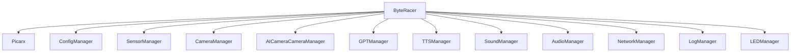
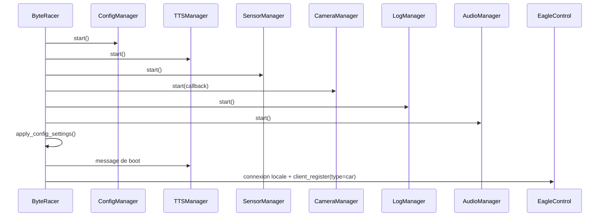

# Main Orchestrator `ByteRacer`

## Role

`byteracer/main.py` contient la classe `ByteRacer`, point d'entree principal du service Python. Cette classe fait le lien entre le materiel Picar-X, les managers specialises, le bus WebSocket `EagleControl` et les commandes emises depuis `RelayTower`.

## Responsabilites principales

- instancier et cabler tous les managers du service Python;
- charger et appliquer la configuration persistante;
- piloter le cycle de vie du robot: boot, connexion WebSocket, arret propre;
- recevoir les messages WebSocket et les router vers le bon manager;
- faire respecter les etats de securite et les priorites entre manuel, urgence et IA;
- renvoyer telemetrie, statuts camera, logs, batterie, GPT et resultats de commandes au client.

## Graphe des dependances

## Sequence de demarrage

## Sequence d'arret

Lors d'un arret propre, `ByteRacer.stop()`:

- coupe les taches asynchrones periodiques;
- tente d'arreter la camera, l'audio, le TTS et la surveillance capteurs;
- stoppe le mouvement du robot;
- ferme la connexion WebSocket si elle est ouverte;
- laisse les managers nettoyer leurs ressources locales.

## Managers instancies

| Manager | Usage depuis `ByteRacer` |
| --- | --- |
| `ConfigManager` | charge, fusionne, sauvegarde et reinitialise `settings.json` |
| `SensorManager` | surveille capteurs et urgences, corrige les commandes de mouvement |
| `CameraManager` | demarre le flux MJPEG et signale les etats `RUNNING`, `FROZEN`, `ERROR` |
| `AICameraCameraManager` | suivi de visage, detection panneaux/feux, circuit mode, calibrations IA |
| `GPTManager` | commandes naturelles, scripts Python, TTS IA, conversation |
| `AudioManager` | capture micro du robot vers le navigateur |
| `SoundManager` | sons embarques, alertes et lecture de flux audio entrants |
| `TTSManager` | synthese vocale asynchrone locale |
| `NetworkManager` | scan Wi-Fi, AP mode, IP, statut reseau |
| `LogManager` | logs fichier + console + diffusion WebSocket |
| `LEDManager` | feedback lumineux simple ou patterns utilises par la vision |

## Dispatcher WebSocket

`ByteRacer.handle_message()` est la porte d'entree de tous les evenements applicatifs recus depuis `EagleControl`. Les familles de messages les plus importantes sont:

- `gamepad_input`: pilotage manuel, servo direction, axes camera et boutons d'action;
- `robot_command`: commandes systeme, mode du robot, redemarrage, urgence, TTS, sons;
- `settings`, `settings_update`, `reset_settings`: lecture et mise a jour de la configuration;
- `network_scan`, `network_update`: scan Wi-Fi, connexion, AP mode;
- `gpt_command`, `cancel_gpt`, `create_thread`: pilotage de `GPTManager`;
- `audio_stream`, `start_listening`, `stop_listening`: audio navigateur <-> robot;
- `battery_request`, `python_status_request`: supervision etat du robot.

## Pilotage manuel

Le flux manuel passe par `handle_gamepad_input()`:

1. lecture des valeurs `speed`, `turn`, `turnCameraX`, `turnCameraY`;
2. passage par `SensorManager.update_motion()` pour tenir compte des restrictions de securite;
3. traduction en commandes moteur / direction / pan / tilt;
4. mise a jour des sons de conduite via `SoundManager`;
5. diffusion periodique de `sensor_data`.

Le front lit la manette a haute frequence, mais `GamepadInputHandler` envoie les commandes vers le robot toutes les `50 ms`, soit environ `20 Hz`.

## Priorites et arbitrage des modes

`ByteRacer` gere trois sources de controle concurrentes:

- l'operateur via `gamepad_input`;
- `SensorManager` en cas d'urgence ou d'auto-stop;
- `GPTManager` ou `AICameraCameraManager` dans les modes autonomes.

Le principe general est le suivant:

- une urgence bloque ou corrige le manuel;
- une commande GPT fait passer le robot en `GPT_CONTROLLED`;
- les modes `CIRCUIT_MODE`, `TRACKING_MODE` et `DEMO_MODE` modifient l'origine des ordres moteur;
- le retour a l'etat normal passe par `restore_robot_state()` cote GPT ou par les setters de `SensorManager`.

## Telemetrie renvoyee au front

`ByteRacer` emet regulierement:

- `sensor_data` pour l'etat du robot;
- `battery_info` sur demande ou lors de certaines mises a jour;
- `camera_status` pour les changements de la camera;
- `settings` apres lecture ou ecriture;
- `command_response` pour chaque action non triviale;
- `gpt_status_update`, `gpt_response`, `speech_recognition` et `audio_stream` via les managers specialises.

## Taches periodiques

Les taches les plus visibles sont:

- annonce IP reguliere tant qu'aucun controle manuel n'est actif;
- envoi periodique de `sensor_data`;
- maintien de la connexion WebSocket locale;
- supervision capteurs par `SensorManager`;
- supervision gel camera par `CameraManager`.

## Commandes systeme les plus importantes

`execute_robot_command()` centralise de nombreuses actions. Les grandes familles sont:

- mouvement et securite: stop, emergency stop, clear manual stop;
- audio: speak text, stop TTS, jouer un son, stopper un son;
- camera: restart camera feed, detection visage/couleur/panneaux;
- IA: lancement GPT, circuit mode, face tracking, calibrations;
- systeme: reboot, shutdown, restart services, update software.

## Points d'extension recommandes

- ajouter un nouveau type de message WebSocket dans `handle_message()` si l'action doit etre exposee au front;
- ajouter un nouveau bloc dans `execute_robot_command()` si l'action est systemique;
- preferer une methode dediee dans un manager plutot qu'un traitement direct dans `main.py`;
- mettre a jour `send_settings_to_client()` ou `apply_config_settings()` quand un nouveau parametre persistant apparait.

## Fichiers a lire avec ce document

- [ARCHITECTURE.md](ARCHITECTURE.md)
- [MODULE_COMMUNICATIONS.md](MODULE_COMMUNICATIONS.md)
- [AI_INTEGRATION.md](AI_INTEGRATION.md)
- [PYTHON_MODULES/README.md](PYTHON_MODULES/README.md)
