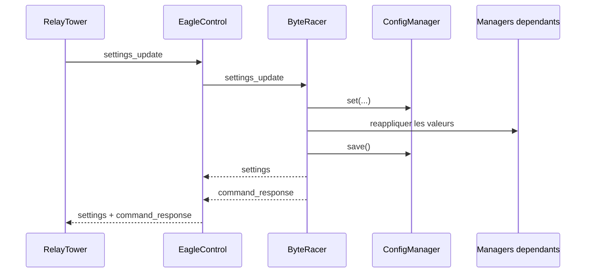
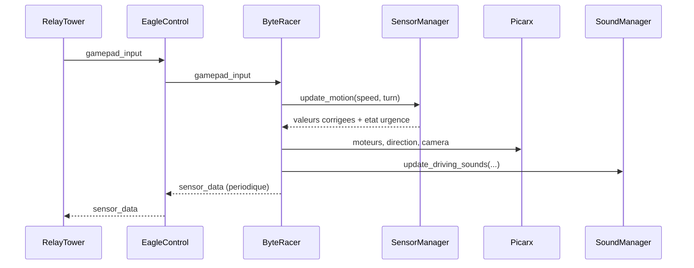
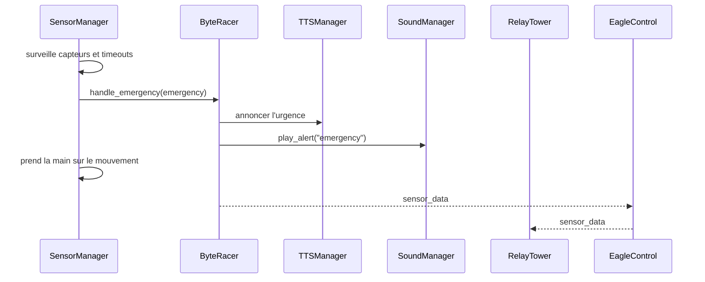

# Communications Entre Modules

## Objectif

Ce document decrit les flux de communication du projet a deux niveaux:

- les communications internes entre les managers Python de `ByteRacer`;
- les communications inter-processus entre `RelayTower`, `EagleControl` et `ByteRacer`.

## 1. Couches de communication

### 1.1 Communications internes dans ByteRacer

A l'interieur du processus Python, les modules communiquent principalement de trois manieres:

- appels directs de methode depuis `ByteRacer`;
- callbacks asynchrones remontant vers `ByteRacer`;
- partage d'objets singleton instancies au demarrage.

Les principaux callbacks sont:

- `SensorManager -> ByteRacer.handle_emergency()` pour les urgences;
- `CameraManager -> ByteRacer.handle_camera_status()` pour les changements d'etat de la camera.

### 1.2 Communications inter-processus

Les processus communiquent de la facon suivante:

- `RelayTower <-> EagleControl` via WebSocket sur le port `3001`;
- `ByteRacer <-> EagleControl` via WebSocket local sur `127.0.0.1:3001`;
- `RelayTower <-> CameraManager/Vilib` via flux MJPEG sur `http://<host>:9000/mjpg`.

### 1.3 Roles WebSocket

`EagleControl` classe chaque connexion dans un role:

| Role | Origine typique | Responsabilite |
| --- | --- | --- |
| `car` | `ByteRacer` | executer et emettre l'etat du robot |
| `controller` | interface operateur | piloter, configurer, declencher des commandes |
| `viewer` | client passif | observer sans piloter |

## 2. Contrat de message WebSocket

Le protocole utilise une enveloppe JSON commune:

```json
{
  "name": "sensor_data",
  "data": {},
  "createdAt": 1741622400000
}
```

Remarques:

- `name` identifie le type d'evenement.
- `data` contient la charge utile metier.
- `createdAt` est un timestamp millisecondes genere par l'emetteur.
- certains messages ajoutent aussi un `timestamp` a l'interieur de `data`.

## 3. Flux internes dans ByteRacer

### 3.1 Configuration



Flux detaille:

1. `RelayTower` envoie `settings_update` avec un fragment partiel de configuration.
2. `ByteRacer.update_settings()` propage les modifications vers `ConfigManager`.
3. Les managers concernes sont reconfigures immediatement.
4. Si des parametres camera changent, `CameraManager.restart()` peut etre declenche.
5. La configuration complete est ensuite renvoyee au client via `settings`.

### 3.2 Pilotage manuel



Flux detaille:

1. `GamepadInputHandler` envoie `gamepad_input` vers le serveur WebSocket.
2. `ByteRacer.handle_gamepad_input()` extrait `speed`, `turn`, `turnCameraX`, `turnCameraY` et les boutons utiles.
3. `SensorManager.update_motion()` applique d'eventuelles contraintes de securite.
4. `ByteRacer` traduit les valeurs en commandes moteur, servo de direction et axes camera.
5. `SoundManager` met a jour les sons de conduite en fonction de la vitesse, du braquage et de l'acceleration.

### 3.3 Securite et urgences



`SensorManager` surveille en continu:

- distance ultrason;
- capteurs de ligne / detection de vide;
- timeout de client;
- niveau de batterie.

Lorsqu'une urgence survient, il peut prendre le dessus sur les commandes utilisateur et modifier le mouvement effectif du robot.

### 3.4 Camera

Flux interne camera:

1. `ByteRacer` demarre `CameraManager` avec un callback de statut.
2. `CameraManager` lance `Vilib`, active l'affichage web et surveille le gel du flux.
3. En cas de changement d'etat (`RUNNING`, `ERROR`, `RESTARTING`, `FROZEN`), le callback `handle_camera_status()` est invoque.
4. `ByteRacer` peut annoncer vocalement certains etats puis renvoyer `camera_status` au client.

### 3.5 GPT et conversation

Flux GPT:

1. Le client envoie `gpt_command`.
2. `ByteRacer` passe en etat `GPT_CONTROLLED` et ignore les `gamepad_input` pendant l'execution.
3. `GPTManager` peut:
   - capturer une image depuis la camera;
   - analyser la requete texte ou vocale;
   - envoyer des `gpt_status_update` progressifs;
   - produire une reponse structuree ou des actions executees sur le robot;
   - renvoyer `gpt_response` et, en mode conversation, `speech_recognition`.

### 3.6 Audio bidirectionnel

Il existe deux flux audio distincts:

- `controller -> car`: `audio_stream` transporte l'audio push-to-talk du navigateur vers le robot. `ByteRacer` le decode et `SoundManager` le lit localement.
- `car -> controller`: `AudioManager` capture le micro du robot, encapsule des WAV en base64 et renvoie aussi un evenement `audio_stream` vers l'interface.

### 3.7 Logs temps reel

`LogManager` accroche un handler WebSocket au logger Python. Chaque log est transforme en evenement `log_message`, puis route vers `controller` et `viewer`.

## 4. Table des messages WebSocket

### 4.1 Messages emis par le client de controle

| Message | Emetteur | Route | Effet cote robot |
| --- | --- | --- | --- |
| `client_register` | `RelayTower` | `controller -> car` | signale qu'un client de controle est connecte |
| `gamepad_input` | `RelayTower` | `controller -> car` | commande mouvement, direction et camera |
| `robot_command` | `RelayTower` | `controller -> car` | declenche une commande systeme ou securite |
| `battery_request` | `RelayTower` | `controller -> car` | demande le niveau de batterie |
| `settings` | `RelayTower` | `controller -> car` | demande la configuration courante |
| `settings_update` | `RelayTower` | `controller -> car` | met a jour la configuration persistante |
| `reset_settings` | `RelayTower` | `controller -> car` | remet tout ou partie des reglages a zero |
| `speak_text` | `RelayTower` | `controller -> car` | fait parler le robot via TTS |
| `play_sound` | `RelayTower` | `controller -> car` | joue un son custom cote robot |
| `stop_sound` | `RelayTower` | `controller -> car` | stoppe les sons en cours |
| `stop_tts` | `RelayTower` | `controller -> car` | arrete la synthese vocale en cours |
| `gpt_command` | `RelayTower` | `controller -> car` | lance un traitement GPT |
| `cancel_gpt` | `RelayTower` | `controller -> car` | annule une commande GPT |
| `create_thread` | `RelayTower` | `controller -> car` | reinitialise le contexte conversationnel |
| `network_scan` | `RelayTower` | `controller -> car` | demande la liste des reseaux Wi-Fi |
| `network_update` | `RelayTower` | `controller -> car` | applique une action reseau |
| `audio_stream` | `RelayTower` | `controller -> car` | envoie l'audio push-to-talk vers le robot |
| `start_listening` | `RelayTower` | `controller -> car` | demande au robot d'activer son micro |
| `stop_listening` | `RelayTower` | `controller -> car` | demande au robot de stopper son micro |
| `start_calibration` / `stop_calibration` / `test_calibration` | `RelayTower` | `controller -> car` | commandes de calibration IA |
| `start_test_calibrate_motors` / `stop_test_calibrate_motors` | `RelayTower` | `controller -> car` | test/calibration moteurs |

### 4.2 Messages emis par le robot

| Message | Emetteur | Route | Usage cote client |
| --- | --- | --- | --- |
| `settings` | `ByteRacer` | `car -> controller/viewer` | hydrate l'interface avec les reglages complets |
| `sensor_data` | `ByteRacer` | `car -> controller/viewer` | telemetrie capteurs, etat, CPU, RAM |
| `battery_info` | `ByteRacer` | `car -> controller/viewer` | niveau de batterie explicite |
| `camera_status` | `ByteRacer` | `car -> controller/viewer` | etat et erreurs camera |
| `command_response` | `ByteRacer` | `car -> controller/viewer` | resultat d'une commande systeme ou d'une action |
| `network_list` | `ByteRacer` | `car -> controller/viewer` | resultat d'un scan reseau + statut de connexion |
| `gpt_status_update` | `ByteRacer` | `car -> controller/viewer` | progression d'une commande GPT |
| `gpt_response` | `ByteRacer` | `car -> controller/viewer` | resultat final d'une commande GPT |
| `speech_recognition` | `ByteRacer` | `car -> controller` | texte reconnu en mode conversation |
| `audio_stream` | `ByteRacer` | `car -> controller` | flux micro du robot vers l'interface |
| `log_message` | `ByteRacer` | `car -> controller/viewer` | log applicatif temps reel |

### 4.3 Messages geres directement par EagleControl

| Message | Traitement | Commentaire |
| --- | --- | --- |
| `ping` | reponse `pong` immediate | utilise pour la latence front |
| `python_status_request` | reponse `python_status` | basee sur la presence d'au moins un client `car` |
| `client_disconnected` | diffuse a tous les clients | emise lorsqu'une connexion se ferme |
| `welcome` | envoyee a l'ouverture | identifiant technique assigne par le serveur |

## 5. Cadences et rythmes de communication

| Flux | Emetteur | Rythme observe |
| --- | --- | --- |
| `ping` | `RelayTower` | toutes les `500 ms` |
| `sensor_data` | `ByteRacer` | toutes les `100 ms` |
| surveillance capteurs | `SensorManager` | toutes les `50 ms` |
| surveillance gel camera | `CameraManager` | verification chaque `1 s`, comparaison sur fenetre de `5 s` |
| annonce IP | `ByteRacer` | toutes les `30 s` sans client actif, `60 s` en controle manuel |

## 6. Points d'attention du protocole

### `settings` est polymorphe

Le meme message `settings` sert a deux choses:

- cote client: une requete de lecture de la configuration;
- cote robot: une reponse contenant `data.settings`.

### `audio_stream` n'a pas exactement la meme charge utile selon le sens

- du client vers le robot: `data.audio`
- du robot vers le client: `data.audioData`

Cette asymetrie doit etre preservee tant que le protocole n'est pas unifie.

### `python_status` ne mesure pas toute la sante applicative

`python_status_request` est resolu par `EagleControl` en regardant s'il existe au moins une connexion `car`. Cela indique qu'un `ByteRacer` est connecte au bus WebSocket, pas que tous ses sous-modules sont sains.

### `clientConnected` dans `sensor_data` ne veut pas seulement dire "site ouvert"

Le champ `clientConnected` est calcule cote robot a partir de `robot_state == MANUAL_CONTROL`. Il indique donc qu'un flux de controle manuel est actif, et non simplement qu'une page web est chargee.

### La video ne passe pas par le WebSocket

Le flux camera est servi a part via MJPEG sur `http://<host>:9000/mjpg`. Une interface peut donc etre connectee au WebSocket tout en ayant un probleme video independant.
