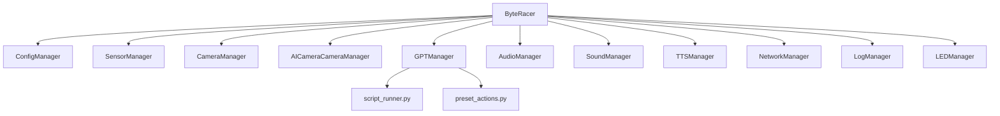

# Modules Python

Ce dossier documente chaque module majeur du service Python `byteracer/`. L'objectif est de faciliter la reprise du code, la revue d'architecture et les futures refactorisations.

## Ordre de lecture recommande

1. [../MAIN_ORCHESTRATOR.md](../MAIN_ORCHESTRATOR.md)
2. [CONFIG_MANAGER.md](CONFIG_MANAGER.md)
3. [SENSOR_MANAGER.md](SENSOR_MANAGER.md)
4. [CAMERA_MANAGER.md](CAMERA_MANAGER.md)
5. [AICAMERA_MANAGER.md](AICAMERA_MANAGER.md)
6. [GPT_MANAGER.md](GPT_MANAGER.md)
7. [AUDIO_MANAGER.md](AUDIO_MANAGER.md)
8. [SOUND_MANAGER.md](SOUND_MANAGER.md)
9. [TTS_MANAGER.md](TTS_MANAGER.md)
10. [NETWORK_MANAGER.md](NETWORK_MANAGER.md)
11. [LOG_MANAGER.md](LOG_MANAGER.md)
12. [LED_MANAGER.md](LED_MANAGER.md)
13. [SCRIPT_RUNNER.md](SCRIPT_RUNNER.md)
14. [PRESET_ACTIONS.md](PRESET_ACTIONS.md)

## Carte des responsabilites

| Module | Role principal |
| --- | --- |
| `config_manager.py` | persistance et fusion des reglages |
| `sensor_manager.py` | securite temps reel et telemetrie capteurs |
| `camera_manager.py` | pilotage `Vilib` / `Picamera2` et sante du flux |
| `aicamera_manager.py` | vision embarquee, suivi de visage et autonomie locale |
| `gpt_manager.py` | commandes naturelles, conversation, TTS IA et actions robot |
| `audio_manager.py` | micro robot vers navigateur |
| `sound_manager.py` | sons embarques et playback audio |
| `tts_manager.py` | synthese vocale locale et file de priorites |
| `network_manager.py` | Wi-Fi, AP mode et statut reseau |
| `log_manager.py` | logs fichiers, console et WebSocket |
| `led_manager.py` | retour lumineux local |
| `script_runner.py` | sandbox d'execution des scripts Python GPT |
| `gpt/preset_actions.py` | animations predefinies du robot |

## Graphe simplifie

## Ce que cette documentation cherche a clarifier

- la responsabilite exacte de chaque module;
- ses dependances entrantes et sortantes;
- les points de configuration relies a `settings.json`;
- les risques techniques et zones de couplage;
- les meilleurs points d'extension pour ajouter une fonctionnalite.
