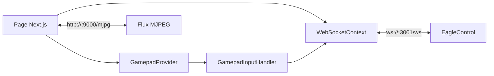

# Web App `RelayTower`

## Role

`RelayTower` est l'interface operateur du robot. C'est une application Next.js qui:

- se connecte a `EagleControl` via WebSocket;
- consomme le flux MJPEG servi par la camera;
- lit les manettes de jeu dans le navigateur;
- expose toutes les commandes de pilotage, de configuration, de debug et d'IA.

## Vue d'ensemble



## Architecture React

Le point d'entree `relaytower/src/app/page.tsx` compose l'application autour de deux providers:

- `WebSocketProvider`: etat reseau, donnees du robot, helpers de commande;
- `GamepadProvider`: detection des manettes, mappings, deadzones et remappage.

Le reste de l'interface consomme ces contexts via des composants specialises.

## Onglets principaux

La presentation du projet montre une interface pensee pour une teleoperation immediate. L'application est organisee en onglets:

- `Control`: flux camera, capteurs, boutons d'action rapide, GPT, audio et statut;
- `Gamepad`: mapping des boutons/axes, calibration et debug manette;
- `Settings`: configuration fine du robot, de la camera, de l'IA et du Git;
- `System`: actions systeme et supervision;
- `Dev Tools`: debug reseau, logs et outils d'observation.

## Composants clefs

| Composant | Role |
| --- | --- |
| `WebSocketContext.tsx` | noyau d'integration front/back, socket lifecycle, cache d'etat et helpers |
| `CameraFeed.tsx` | affichage MJPEG, fullscreen, overlay telemetrie et restart camera |
| `GamepadInputHandler.tsx` | transforme les mappings navigateur en messages `gamepad_input` a `20 Hz` |
| `useGamepad.ts` | lecture Gamepad API, deadzones, inversion, normalisation et persistance locale |
| `RobotControls.tsx` | controle manuel, modes, commandes systeme, TTS et actions rapides |
| `RobotSettings.tsx` | edition de `settings.json` exposee depuis l'interface |
| `GptIntegration.tsx` | saisie GPT, options camera/voix, thread management, retour de statut |
| `PushToTalk.tsx` | micro navigateur vers robot |
| `Listen.tsx` | micro robot vers navigateur |
| `NetworkSettings.tsx` | scan Wi-Fi, AP mode, configuration SSID/mot de passe |
| `LogViewer.tsx` | flux de logs Python temps reel |

## `WebSocketContext`: le point de verite front

`WebSocketContext` centralise:

- l'ouverture et la fermeture du socket;
- le `client_register` initial en `controller`;
- le `ping` periodique toutes les `500 ms`;
- les requetes initiales (`settings`, `battery_request`, `python_status_request`);
- le stockage local de `sensorData`, `settings`, `logs`, `gptStatus`, `cameraStatus`, `pythonStatus`;
- les wrappers d'emission: `sendRobotCommand`, `updateSettings`, `sendGptCommand`, `sendAudioChunk`, `scanNetworks`, etc.

En pratique, presque tous les composants UI parlent a `WebSocketContext`, pas directement au socket.

## Pipeline gamepad

La presentation mentionne une lecture navigateur tres frequente, puis un echantillonnage reseau limite pour garder une latence faible sans saturer le bus.

Le pipeline reel est:

1. `useGamepad.ts` lit les pads exposes par le navigateur;
2. les mappings utilisateur sont stockes en `localStorage`;
3. `GamepadInputHandler.tsx` calcule un etat agrege;
4. les valeurs sont envoyees toutes les `50 ms`;
5. `ByteRacer` interprete les axes et les fait passer par `SensorManager`.

Les groupes d'axes utilises par le projet sont:

- `speed`;
- `turn`;
- `turnCameraX`;
- `turnCameraY`.

## Flux video

Le flux video n'est pas transporte par le WebSocket. `CameraFeed.tsx` charge directement:

```text
http://<hostname>:9000/mjpg
```

Fonctionnalites visibles dans le composant:

- reprise automatique du flux apres changement de page;
- mode plein ecran;
- overlay d'information capteurs;
- affichage d'une alerte si le backend remonte `FROZEN`;
- bouton de redemarrage camera.

## Audio bidirectionnel

La presentation decrit un pipeline audio en chunks WAV base64 de l'ordre de `250 ms`.

Dans l'application:

- `PushToTalk.tsx` capture le micro navigateur, encode en WAV et envoie `audio_stream`;
- `Listen.tsx` recoit `audio_stream` emis par le robot, decode le WAV et le joue via Web Audio;
- l'ecoute se coupe automatiquement pendant le push-to-talk pour eviter l'echo;
- le mode push-to-talk peut etre associe a un bouton de manette.

## GPT et IA dans le front

`GptIntegration.tsx` est la facade operateur de `GPTManager`. Le composant:

- laisse saisir une commande texte;
- peut demander une image camera au moment de l'appel;
- active ou non la voix IA pour la reponse;
- active ou non le mode conversationnel;
- affiche les messages de statut intermediaires (`gpt_status_update`);
- affiche le resultat final et le texte reconnu en mode conversation.

Le front ne fait aucune interpretation IA locale. Il collecte les options utilisateur et affiche l'etat du traitement pilote par Python.

## Gestion des reglages

`RobotSettings.tsx` est plus qu'un simple formulaire. Il expose:

- camera: flip, streaming, resolution et options de detection;
- securite: collision, edge detection, auto-stop, buffers et cooldowns;
- drive: comportement mouvement;
- modes: activation de modes autonomes;
- Git: branche, repo et auto-update;
- API: cle OpenAI;
- AI: seuils de pause, distances, vitesses, timings et parametres de tracking;
- LED: activation des retours lumineux.

Certaines actions presentes dans le panneau ont un effet immediat:

- restart camera;
- calibration de virage a droite;
- test/calibration moteurs;
- changement de mode.

## Couplage au backend

L'application depend fortement des noms de messages WebSocket et des shapes JSON renvoyees par `ByteRacer`. Les couplages les plus sensibles sont:

- `audio_stream` n'a pas la meme structure selon le sens de circulation;
- `settings` sert a la fois de requete et de reponse;
- `python_status` vient de `EagleControl`, pas directement de Python;
- le flux camera est decouple du WebSocket.

## Points forts de l'architecture front

- separation nette entre UI, contexte reseau et logique manette;
- panneau de configuration presque complet sans SSH;
- outils d'observabilite directement dans l'interface: logs, camera status, python status, battery, latency.

## Points d'attention pour une evolution future

- garder la compatibilite des noms de messages avec `ByteRacer`;
- documenter toute nouvelle cle de settings dans `RobotSettings.tsx` et `ConfigManager`;
- tester les nouveaux composants en mode sans robot connecte, car certains dependents implicites peuvent casser le rendu;
- surveiller le poids du state dans `WebSocketContext` si de nouvelles familles de donnees temps reel sont ajoutees.
